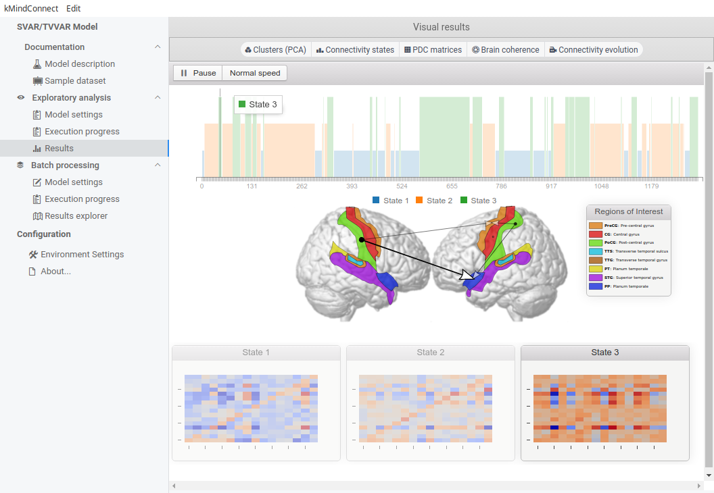

# kMindConnect

kMindConnect is a software package developed with the aim of offering seamless integration between different the Brain dynamic connectivity modelling and the visualization results. The toolbox provides an easy way to present the dynamic changes in the estimated Brain states (or connectivity.) The default model to perform this estimation inside the application is the switching-regime vector autoregressive model (S-VAR) that is fitted over clustered time-varying vector autoregressive (TV-VAR) coefficients from the data input [Ting, Samdin, Ombao, 2016].


> Ting, C. M., Samdin, S. B., Ombao, H., & Salleh, S. H. (2016). A Unified Estimation Framework for State-Related Changes in Effective Brain Connectivity.

The source code is available in two repositories under the specified licenses:

* [github.com/marcoapintoo/kaust.kmindconnect](https://github.com/marcoapintoo/kaust.kmindconnect/): For major versions and the binary installers;

* [bitbucket.org/tonitruum/kaust.kmindconnect](https://bitbucket.org/tonitruum/kaust.kmindconnect/): For continuous development.

# Features

## Timeline of states


## Visual animation



## Simulation timing


# Requirements

## Preparing the environment on Ubuntu/Debian


* Step 1: **Install Octave**
```
    sudo apt install octave octave-signal octave-statistics
```
* Step 2: **Install Anaconda/Python3**
* Step 3: **Install additional Python packages**
```
    pip install oct2py 
    conda install plotly
    conda install docopt
```
* Step 4: **Install node and electron** (*Only for building the software*)
```
    sudo apt install node
    sudo npm install -g electron --unsafe-perm=true --allow-root
```

# License

Licensed under either

* GPL license, Version 3.0, (GPL-LICENSE or https://opensource.org/licenses/GPL-3.0)
* MIT license (MIT-LICENSE or http://opensource.org/licenses/MIT)

